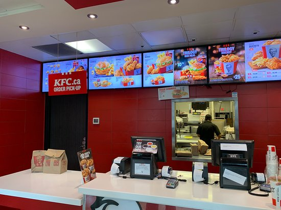

# KFC-Billing-System
>
# Project Title
### KFC Billing System
# Description
The KFC Billing System is a streamlined solution to enhance customer experience from order to payment. It starts with a warm Entry greeting, followed by an intuitive Menu for easy item selection. The system captures Orders accurately, allows customers to choose a Service Counter, includes a Tip option, calculates and prints the Bill, and provides a Rating feature for feedback. This system prioritizes efficiency, accuracy, and customer satisfaction.
# Methodology
1. **Requirement Analysis**:

   Identify key features such as entry greeting, menu display, order capture, service counter selection, tip handling, billing, and customer rating. Define user needs and technical requirements.
2. **System Design**:

   Outline the system architecture, design user interfaces for seamless interactions, and plan the data flow between components like menu selection, billing, and rating.
3. **Technology Selection**:

   Choose appropriate technologies and frameworks for development, such as programming languages, database management systems, and interface design tools to ensure efficiency and scalability.
4. **Implementation**:
   
   Develop each feature step-by-step:

     - **Entry**: Implement a welcoming message.
     - **Menu**: Design a clear, interactive menu interface.
     - **Order Management**: Code for item selection and quantity input.
     - **Service Counter Selection**: Allow customers to choose counters.
     - **Tip**: Add an optional tipping feature.
     - **Billing**: Automate calculation and receipt generation.
     - **Rating**: Create a feedback module for ratings out of 5.
     - **Testing**: Conduct thorough testing for functionality, usability, and accuracy across all modules. Use unit tests, integration tests, and user acceptance tests to ensure quality.
5. **Deployment**:
  
   Deploy the system for use, ensuring all components function smoothly in the live environment.
6. **Maintenance and Updates**:
  
   Regularly monitor system performance, gather user feedback, and make necessary updates to improve functionality and address any issues.
